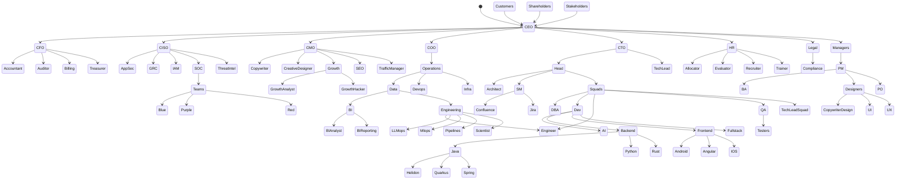

# State Graph - Hierarchical Flow

## State Graph Mermaid

## Fluxo Hierárquico Descrição

1. **Nível C-Level (CEO)**: O CEO está no topo da hierarquia, reportando diretamente aos Shareholders e interagindo com Stakeholders e Customers.
2. **Diretorias (CFO, CISO, CMO, COO, CTO, HR, Legal, Managers)**: Todas as diretorias reportam ao CEO.
3. **Subdivisões por Diretoria**:
   - **CFO**: Accountant, Auditor, Billing, Treasurer
   - **CISO**: AppSec, GRC, IAM, SOC (com Teams: Blue, Purple, Red), ThreatIntel
   - **CMO**: Copywriter, CreativeDesigner, Growth (com GrowthAnalyst, GrowthHacker), SEO, TrafficManager
   - **COO**: Operations (com Data, Devops, Infra), onde Data se divide em BI (BIAnalyst, BIReporting) e Engineering (Engineer, LLMops, Mlops, Pipelines, Scientist)
   - **CTO**: Head (com Architect, SM, Squads), onde SM gerencia Confluence e Jira, e Squads gerencia DBA, Dev (com AI, Backend, Frontend, Fullstack), Engineer, QA (com Testers), TechLeadSquad
   - **HR**: Allocator, Evaluator, Recruiter, Trainer
   - **Legal**: Compliance
   - **Managers**: PM (com BA, Designers, PO), onde Designers se divide em CopywriterDesign, UI, UX
