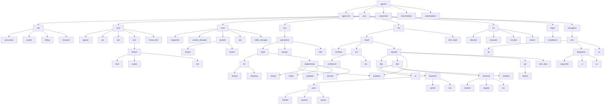

# System Structure Diagram

## Mermaid Directory Structure

```mermaid
graph TD
    Agents[agents/]
    AgentMD[agent.md]
    
    Agents --> AgentMD
    Agents --> CEO[ceo/]
    Agents --> Customers[customers/]
    Agents --> Shareholders[shareholders/]
    Agents --> Stakeholders[stakeholders/]
    
    CEO --> CFO[cfo/]
    CEO --> CISO[ciso/]
    CEO --> CMO[cmo/]
    CEO --> COO[coo/]
    CEO --> CTO[cto/]
    CEO --> HR[hr/]
    CEO --> Legal[legal/]
    CEO --> Managers[managers/]
    
    CFO --> Accountant[accountant]
    CFO --> Auditor[auditor]
    CFO --> Billing[billing]
    CFO --> Treasurer[treasurer]
    
    CISO --> AppSec[appsec]
    CISO --> GRC[grc]
    CISO --> IAM[iam]
    CISO --> SOC[soc/]
    CISO --> ThreatIntel[threat_intel]
    
    SOC --> Teams[teams/]
    Teams --> Blue[blue]
    Teams --> Purple[purple]
    Teams --> Red[red]
    
    CMO --> Copywriter[copywriter]
    CMO --> CreativeDesigner[creative_designer]
    CMO --> Growth[growth/]
    CMO --> SEO[seo]
    CMO --> TrafficManager[traffic_manager]
    
    Growth --> GrowthAnalyst[analyst]
    Growth --> GrowthHacker[hacker]
    
    COO --> Operations[operations/]
    
    Operations --> Data[data/]
    Operations --> Devops[devops]
    Operations --> Infra[infra]
    
    Data --> BI[bi/]
    Data --> Engineering[engineering/]
    
    BI --> BIAnalyst[analyst]
    BI --> BIReporting[reporting]
    
    Engineering --> Engineer[engineer]
    Engineering --> LLMops[llmops]
    Engineering --> Mlops[mlops]
    Engineering --> Pipelines[pipelines]
    Engineering --> Scientist[scientist]
    
    CTO --> Head[head/]
    CTO --> TechLead[tech_lead/]
    
    Head --> Architect[architect]
    Head --> SM[sm/]
    Head --> Squads[squads/]
    
    SM --> Confluence[confluence]
    SM --> Jira[jira]
    
    Squads --> DBA[dba]
    Squads --> Dev[dev/]
    Squads --> Engineer[engineer]
    Squads --> QA[qa/]
    Squads --> TechLeadSquad[tech_lead]
    
    Dev --> AI[ai]
    Dev --> Backend[backend/]
    Dev --> Frontend[frontend/]
    Dev --> Fullstack[fullstack]
    
    Backend --> Java[java/]
    Backend --> Python[python]
    Backend --> Rust[rust]
    
    Java --> Helidon[helidon]
    Java --> Quarkus[quarkus]
    Java --> Spring[spring]
    
    Frontend --> Android[android]
    Frontend --> Angular[angular]
    Frontend --> IOS[ios]
    
    QA --> Testers[testers]
    
    HR --> Allocator[allocator]
    HR --> Evaluator[evaluator]
    HR --> Recruiter[recruiter]
    HR --> Trainer[trainer]
    
    Legal --> Compliance[compliance]
    
    Managers --> PM[pm/]
    
    PM --> BA[ba]
    PM --> Designers[designers/]
    PM --> PO[po]
    
    Designers --> CopywriterDesign[copywriter]
    Designers --> UI[ui]
    Designers --> UX[ux]
```
